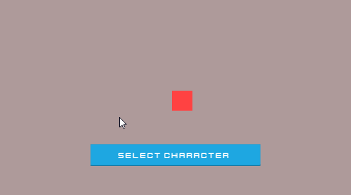
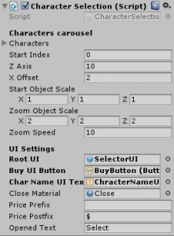

# [Unity3D] Character Selection Screen
A character selection like crossy road for Unity3D

The asset has a demo scene where you can see what’s inside the character selection screen, configure it as you want, experiment with the settings.

All UI elements are made using standard Unity UI funds, so they are fully customizable.

List CSCallback functions:

    OnInit () — called when initializing
    OnShowSelector () / OnCloseSelector () — called when opening / closing the selection screen
    OnSwipe (int index, Character character) — called when you scroll the list of characters. index — the index of the character, character — character.
    OnClickToSelectCharacter (int index, Character character) — called when the button is pressed to select a character, if it is open, or the purchase button if closed.

Each Character type element of the array contains:

    Character GameObject
    Name
    Description
    Price
    Opened/Closed

Character Selection Screen settings:

